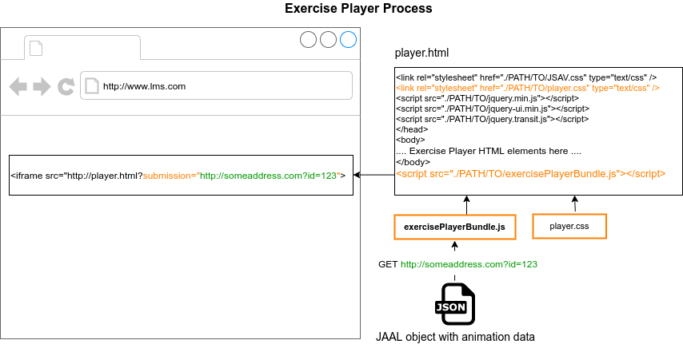

When the Exercise Player bundle file is loaded into the HTML document, it automatically looks for the URL parameter named *sumbission*, which should contain the URL to be used by for fetching the animation data. The system loading the Exercise Player has to provide the *submission* URL parameter when loading the Exercise Player HTML file (player.html).

Since the Exercise Player uses certain HTML elements to construct the animation, it is important that it is imported in the HTML document (player.html) after the `<body>`element.

## To run the tests
The tests are written with Jest. To run the tests do this directory:

- `npm install` in the root folder of this project (if you have not done yet).
- `npm run test`.

## Build the bundle file
To bundle all the required modules in one file use [Browserify](http://browserify.org/):
- `npm install` in the root folder of this project (if you have not done yet).
- `npm install -g browserify` if you have not installed it yet.
- `browserify exerciseRecorder.js > build/jsav-exercise-player-bundle.js.js`.
